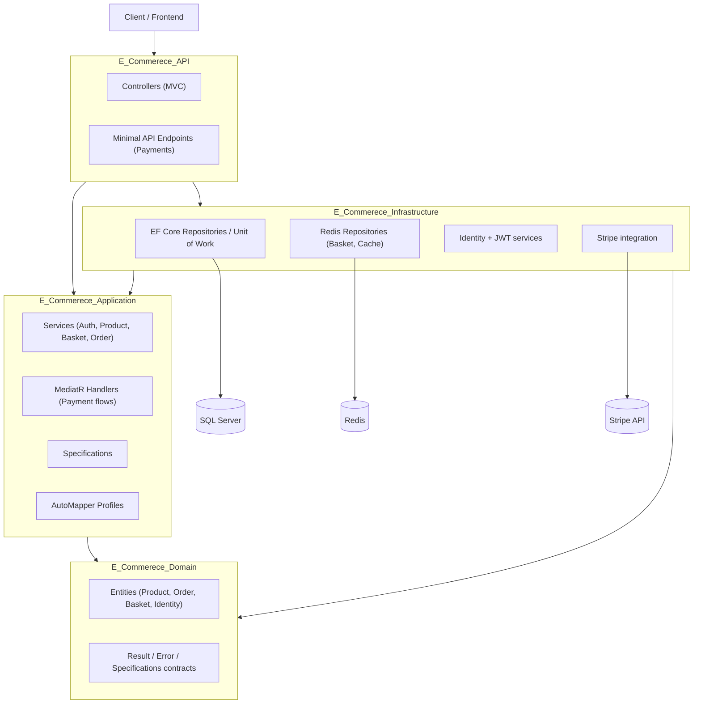

# E-Commerce API

[](https://dotnet.microsoft.com/) [](https://learn.microsoft.com/ef/core/) [](https://www.microsoft.com/sql-server) [](https://redis.io/)

A backend Web API for an e-commerce storefront, built with ASP.NET Core 8 and a layered (Clean Architecture-inspired) structure. It exposes endpoints for browsing a product catalog, managing a shopping basket, placing orders, and paying for them through Stripe.

> This README was written by inspecting the actual source code of this repository. Anything not implemented in the code is either omitted or explicitly marked as a limitation/future improvement below.

## Table of Contents

- [Project Overview](#project-overview)
- [Key Features](#key-features)
- [Architecture](#architecture)
- [Technologies & Tools](#technologies--tools)
- [Project Structure](#project-structure)
- [Authentication & Authorization](#authentication--authorization)
- [Database](#database)
- [API Endpoints](#api-endpoints)
- [Payments](#payments)
- [Caching](#caching)
- [Validation & Error Handling](#validation--error-handling)
- [Getting Started](#getting-started)
- [Configuration](#configuration)
- [Example API Usage](#example-api-usage)
- [Swagger](#swagger)
- [Deployment](#deployment)
- [Known Limitations](#known-limitations)
- [Future Improvements](#future-improvements)
- [Author](#author)

## Project Overview

This project is the backend for a simple online clothing store. It lets a client application (a separate frontend, not part of this repo) do the usual e-commerce flow:

- Browse products with filtering, sorting, search and pagination
- View product brands and types
- Register/log in and manage a saved shipping address
- Keep a basket of items (stored in Redis, not tied to a signed-in account)
- Convert a basket into an order
- Pay for the order through Stripe and have the order marked as paid via a Stripe webhook

It is a personal/learning-oriented project that follows a layered architecture with a domain layer, application layer, infrastructure layer and API layer, using patterns such as Repository, Unit of Work, Specification, CQRS-style handlers (via MediatR, only for payments) and a `Result<T>` pattern for error handling instead of throwing exceptions for expected failures.

## Key Features

| Feature | Status | Notes |
|---|---|---|
| JWT Authentication (Register/Login) | Implemented | ASP.NET Core Identity + JWT bearer tokens |
| Role support (Admin/SuperAdmin) | Partially implemented | Roles are seeded and included in the JWT, but no endpoint currently restricts access by role |
| Saved shipping address | Implemented | Get/update the current user's address |
| Product catalog (list/get by id) | Implemented | Includes brand and type |
| Filtering, search, sorting | Implemented | By brand, type, name search, and price/name sorting |
| Pagination | Implemented | `PageIndex` / `PageSize`, capped at 50 |
| Response caching (Redis) | Implemented | Applied to `GET /api/products` via an action filter |
| Basket (cart) | Implemented | Stored in Redis, keyed by basket id, no DB persistence |
| Order creation | Implemented | Built from a basket + delivery method + shipping address |
| Stripe payment intents | Implemented | Create/update a PaymentIntent for an order |
| Stripe webhook handling | Implemented | Marks an order as paid on `payment_intent.succeeded` |
| Product images | Implemented | Served as static files from `wwwroot` |
| Data seeding | Partially implemented | Seeder looks for JSON files under a `DataSeed` folder that is **not included in this repository** |

## Architecture

The solution follows a layered architecture split into four projects. Dependencies flow inward: `API` depends on `Application` and `Infrastructure`; `Application` and `Infrastructure` depend on `Domain`; `Domain` has no dependencies on the other layers.



**Layers:**

- **`E_Commerece_Domain`** – Entities (`Product`, `Order`, `CustomerBasket`, `ApplicationUser`, etc.), the `Result`/`Error` pattern, order-specific error catalog, and the core abstractions (`IGenericRepository`, `ISpecification`, `IUnitOfWork`). No dependency on any other project.
- **`E_Commerece_Application`** – Business logic: services (`ProductService`, `BasketService`, `OrderService`, `AuthService`, `StripePaymentService`), DTOs, AutoMapper profiles, LINQ specifications, and the two MediatR command handlers used for the payment flow.
- **`E_Commerece_Infrastructure`** – Implementations backed by real technology: EF Core `DbContext`s, generic repository + unit of work, Redis-backed basket/cache repositories, ASP.NET Core Identity setup, JWT token generation, and data seeders.
- **`E_Commerece_API`** – ASP.NET Core Web API host: MVC controllers, two minimal-API endpoint groups (for payments), Swagger, CORS, static file serving, and app startup/composition (`Program.cs`).

## Technologies & Tools

| Technology | Where it's used |
|---|---|
| .NET 8 / ASP.NET Core 8 | Web API host, target framework for all projects |
| Entity Framework Core 8 (SQL Server provider) | Catalog/orders persistence and Identity persistence |
| SQL Server | Relational database (two separate databases, see [Database](#database)) |
| ASP.NET Core Identity | User accounts, password hashing, roles |
| JWT Bearer Authentication (`System.IdentityModel.Tokens.Jwt`) | Issuing/validating access tokens |
| StackExchange.Redis | Basket storage and response caching |
| Stripe.net | Payment intents and webhook verification |
| MediatR | Command/handler pattern for the payment endpoints |
| AutoMapper | Entity ↔ DTO mapping |
| Swashbuckle (Swagger/OpenAPI) | API documentation/exploration UI |
| ASP.NET Core Data Annotations | DTO-level validation (`[Required]`, `[EmailAddress]`) |

> No FluentValidation package is referenced in any `.csproj`, even though it's a common pairing with this kind of architecture — validation here is done through Data Annotations on a couple of DTOs and manual checks inside services/entities.

## Project Structure

```
E_Commerece/
├── E_Commerece.sln
│
├── E_Commerece_Domain/                 # Core entities & abstractions, no external deps
│   ├── Entites/
│   │   ├── Baskets/                    # CustomerBasket, BasketItem
│   │   ├── Identity/                   # ApplicationUser, Address
│   │   ├── Orders/                     # Order, OrderItem, OrderAddress, DeliveryMethod, OrderStatus
│   │   ├── Products/                   # Product, ProductBrand, ProductType
│   │   └── BaseEntity.cs
│   ├── Contract/                       # IGenericRepository, IUnitOfWork, ISpecification, IDataSeeder, ...
│   ├── Errors/                         # OrderErrors (typed error catalog)
│   └── Shared/                         # Result<T>, Error, ErrorType
│
├── E_Commerece_Application/            # Business logic
│   ├── Common/                         # PaginatedResult, ApiMessages, Stripe settings
│   ├── Contracts/                      # Service interfaces (IProductService, IAuthService, ...)
│   ├── Dtos/                           # Request/response DTOs
│   ├── Params/                         # ProductQueryParams, ProductSortingOption
│   ├── Payment/                        # MediatR commands/handlers for Stripe payment flow
│   ├── Profiles/                       # AutoMapper profiles
│   ├── Service/                        # ProductService, BasketService, OrderService, AuthService, CachService, StripePaymentService
│   ├── Specifications/                 # LINQ specifications (filtering/sorting/paging)
│   └── ApplicationServiceRegister.cs   # DI registration for this layer
│
├── E_Commerece_Infrastructure/         # EF Core, Redis, Identity, Stripe wiring
│   ├── Data/
│   │   ├── Configrations/              # IEntityTypeConfiguration<> classes
│   │   ├── Migrations/                 # EF Core migrations
│   │   ├── StoreDbContext.cs           # Catalog + Orders DbContext
│   │   └── StoreIdentityDbContext.cs   # Identity DbContext
│   ├── DataSeeding/                    # CatalogDataSeeder, IdentityDataSeeder
│   ├── Repository/                     # GenericRepository, UnitOfWork, BasketRepository, CachRepository
│   ├── Services/                       # JWTAccessTokenGenerator, CurrentUserService, UserStore
│   └── InfrastructureServiceRegister.cs
│
└── E_Commerece_API/                    # Web API host
    ├── Attributes/                     # RedisCachedAttribute
    ├── Controllers/                    # AuthController, ProductsController, BasketsController, OrderController
    ├── EndPoints/                      # PaymentEndpoints, CreateOrderPaymentEndpoint (minimal APIs)
    ├── wwwroot/Files/Images/Products/   # Seeded product images served as static files
    ├── appsettings*.json
    └── Program.cs
```

## Authentication & Authorization

- Authentication is built on **ASP.NET Core Identity** (`IdentityCore<ApplicationUser>` with `IdentityRole`), backed by its own `StoreIdentityDbContext`.
- On login/register, the API issues a **JWT bearer token** (`JWTAccessTokenGenerator`) containing the user's id (`NameIdentifier`), email, display name, and role claims. Token lifetime is configurable via `JWT:ExpireMinutes`.
- Protected endpoints use the standard `[Authorize]` attribute (`BasketsController`, `OrderController`, and the address endpoints on `AuthController`). `ProductsController` and the login/register/email-check endpoints are open.
- Two Identity roles (`Admin`, `SuperAdmin`) are seeded on startup, and a default admin user is created if none exists (see [Database](#database)). **No controller or endpoint currently enforces role-based access** — roles exist in the token but aren't used for authorization checks yet.
- `ICurrentUserService` exposes the current user's id/email/authentication state (from `HttpContext`) to the application layer, decoupling business logic from `HttpContext` directly.
- Passwords are validated with Identity's built-in rules configured in `InfrastructureServiceRegister` (digit required, lowercase required, minimum length 6, uppercase/special characters not required).

## Database

The project uses **two separate SQL Server databases**, each with its own `DbContext`:

| DbContext | Purpose | Connection string key |
|---|---|---|
| `StoreDbContext` | Products, brands, types, orders, order items, delivery methods | `DefaultConnection` |
| `StoreIdentityDbContext` | Users, roles, user-roles, addresses (extends `IdentityDbContext<ApplicationUser>`) | `IdentityConnection` |

Key relationships:

- `Product` → `ProductBrand` (many-to-one) and `Product` → `ProductType` (many-to-one).
- `Order` → many `OrderItem` (cascade delete) and `Order` → `DeliveryMethod` (restrict delete).
- `Order.Address` is mapped as an **owned entity** (`OrderAddress`), not a separate related table — each order stores its own shipping address snapshot.
- `ApplicationUser` → `Address` (one-to-one) — a user's *saved* address, separate from the address snapshot stored on each order.

**Migrations:** EF Core migrations exist for both the catalog/orders schema (`AddProductModul`, `AddOrderModule`, `AddOrderIntent`, and a nullable-name fix for `Address`). Migrations are applied automatically at startup — both seeders check for and apply pending migrations before seeding data.

**Seed data:** `CatalogDataSeeder` seeds `ProductBrand`, `ProductType`, `Product`, and `DeliveryMethod` from JSON files (`brands.json`, `types.json`, `products.json`, `DelivaryMethod.json`) expected under a `DataSeed` folder next to the compiled output. **These JSON files are not included in this repository** — you'll need to add them yourself (matching the corresponding entity shape) for seeding to actually insert data; otherwise the seeder logs a warning and continues. `IdentityDataSeeder` seeds the `Admin`/`SuperAdmin` roles and a default admin user (`youssef@gmail.com` / seeded with a placeholder password — **change this before using anything beyond local development**).

## API Endpoints

Base route for controllers is `api/[controller-name]`. Two additional endpoint groups are registered as minimal APIs under `api/orders` and `api/payments`.

### Auth (`api/Auth`)

| Method | Endpoint | Purpose | Auth required |
|---|---|---|---|
| POST | `/api/Auth/login` | Log in with email/password, returns a JWT | No |
| POST | `/api/Auth/register` | Create a new user account | No |
| GET | `/api/Auth/EmailExist?email=` | Check whether an email is already registered | No |
| GET | `/api/Auth/address` | Get the current user's saved address | Yes |
| PUT | `/api/Auth/address` | Create/update the current user's saved address | Yes |

### Products (`api/Products`)

| Method | Endpoint | Purpose | Auth required |
|---|---|---|---|
| GET | `/api/Products` | List products, supports `BrandId`, `TypeId`, `SearchValue`, `Sort`, `PageIndex`, `PageSize`. Response cached in Redis for ~1000s. | No |
| GET | `/api/Products/{id}` | Get a single product by id | No |
| GET | `/api/Products/Brands` | List all product brands | No |
| GET | `/api/Products/Types` | List all product types | No |

### Baskets (`api/Baskets`)

| Method | Endpoint | Purpose | Auth required |
|---|---|---|---|
| GET | `/api/Baskets/{id}` | Get a basket by id | Yes |
| POST | `/api/Baskets` | Create or replace a basket | Yes |
| DELETE | `/api/Baskets/{id}` | Delete a basket | Yes |

### Orders (`api/Order` and `api/orders`)

| Method | Endpoint | Purpose | Auth required |
|---|---|---|---|
| POST | `/api/Order/create` | Create an order from a basket, delivery method and shipping address | Yes |
| POST | `/api/orders/{id}/pay` | Create (or update the amount of) a Stripe PaymentIntent for the order | Handler checks `ICurrentUserService`; no `[Authorize]`/`AllowAnonymous` set explicitly on this minimal API |

### Payments (`api/payments`)

| Method | Endpoint | Purpose | Auth required |
|---|---|---|---|
| POST | `/api/payments/webhook` | Stripe webhook receiver — verifies the signature and marks the matching order as paid on `payment_intent.succeeded` | No (`AllowAnonymous`, verified via Stripe signature instead) |

## Payments

Stripe is integrated through `Stripe.net` and used as follows:

1. A client creates an order (`POST /api/Order/create`).
2. The client requests a PaymentIntent for that order (`POST /api/orders/{id}/pay`). `CreateOrderPaymentCommandHandler` looks up the order (scoped to the current user), checks it's still `Pending`, computes the amount in the smallest currency unit from `order.SubTotal`, and either creates a new PaymentIntent or updates the existing one if the client calls this endpoint again (e.g. after the basket total changes). The order's `PaymentIntentId` is stored on success, and the Stripe `clientSecret` is returned to the client for use with Stripe.js/Stripe Elements on the frontend.
3. Stripe calls back to `POST /api/payments/webhook`. The handler verifies the `Stripe-Signature` header against the configured webhook secret, reads the `OrderId` out of the PaymentIntent metadata, and calls `order.MarkAsPaid(...)`, which transitions the order from `Pending` to `Processing` and records the payment timestamp. The transition is idempotent — calling it again with the same PaymentIntent id is a no-op success.

Amounts are always computed **server-side** from `order.SubTotal` (not trusted from the client). No secrets or keys from this project's configuration are reproduced in this document — see [Configuration](#configuration) for what needs to be supplied.

## Caching

Redis (via `StackExchange.Redis`) is used for two distinct things:

1. **Basket storage** (`BasketRepository`) — the *entire* basket, not just a cache. Baskets are JSON-serialized and stored under the basket id as the Redis key with a 30-day expiration if none is specified. There is no SQL persistence for baskets.
2. **Response caching** (`RedisCachedAttribute`, `CachService` + `CachRepository`) — an `ActionFilterAttribute` applied to `GET /api/Products`. It builds a cache key from the request path and sorted query string, returns the cached JSON directly if present, and otherwise lets the action execute and caches the resulting `OkObjectResult` payload for 1000 seconds (~16.7 minutes).

## Validation & Error Handling

- **DTO validation** is limited to ASP.NET Core's built-in model validation via Data Annotations — currently only `LoginDto` uses `[Required]`/`[EmailAddress]`. Most other DTOs (e.g. `RegisterDto`, `OrderToCreateDto`) have no attribute-based validation and rely on service-level checks instead.
- **Domain-level validation** happens inside entities/services: e.g. `Order.AttachPaymentIntent` and `Order.MarkAsPaid` return a `Result` and reject invalid state transitions (already paid, cancelled order, mismatched payment intent, etc.), with a dedicated `OrderErrors` catalog of typed errors.
- **Error handling** is done through a `Result` / `Result<T>` pattern (`E_Commerece.Domain.Shared`) rather than exceptions for expected failure cases. Each `Error` carries a `Code`, `Description`, and `ErrorType` (`Validation`, `NotFound`, `Conflict`, `Unauthorized`, `Forbidden`, `Failure`).
- `ApiBaseController.ToActionResult(...)` converts a `Result`/`Result<T>` into the appropriate HTTP response: `200 OK` on success, or a `ProblemDetails` response with a status code mapped from the `ErrorType` on failure (400/401/403/404/409/500).
- The minimal API endpoints (payments) return raw `Results.Ok(...)` / `Results.BadRequest(...)` rather than going through `ApiBaseController`, so their error shape is slightly different from the controller-based endpoints.
- Unhandled exceptions are not caught by a global exception-handling middleware in this project — there's no `UseExceptionHandler`/custom middleware registered in `Program.cs`.

## Getting Started

### Prerequisites

- [.NET 8 SDK](https://dotnet.microsoft.com/download/dotnet/8.0)
- SQL Server (local or remote) — two databases will be created via migrations
- Redis (local instance or a hosted provider)
- A Stripe account (test mode is fine) if you want to exercise the payment flow

### Steps

1. **Clone the repository**
   ```bash
   git clone https://github.com/youssefhagar/E_Commerece.git
   cd E_Commerece
   ```

2. **Configure connection strings** in `E_Commerece_API/appsettings.json` (or via user secrets / environment variables):
   ```json
   "ConnectionStrings": {
     "DefaultConnection": "Server=.;Database=ECommerce;Trusted_Connection=True;TrustServerCertificate=True;",
     "IdentityConnection": "Server=.;Database=ECommerceIdentity;Trusted_Connection=True;TrustServerCertificate=True;",
     "RedisConnection": "localhost"
   }
   ```

3. **Configure JWT settings** (issuer/audience/secret/expiry) under the `JWT` section — use a strong secret of your own rather than the placeholder committed in the repo.

4. **Configure Redis** — point `RedisConnection` at a local `redis-server` instance or a hosted Redis endpoint (e.g. Upstash, as used in the production config sample).

5. **Configure Stripe** — set `Strip:Secretkey`, `Strip:Publishablekey`, and `Strip:WebHookSecretkey` to your own Stripe test-mode keys (see [Configuration](#configuration)). Use the Stripe CLI to forward webhook events to `/api/payments/webhook` while testing locally.

6. **Add seed data (optional but recommended)** — create a `DataSeed` folder alongside the API project (so it's copied to the output directory) containing `brands.json`, `types.json`, `products.json`, and `DelivaryMethod.json` matching the corresponding entity properties. Without these files the catalog tables will simply stay empty.

7. **Apply migrations** — this happens automatically on startup (`SeedDataAsync` checks for and applies pending migrations for both databases), or you can apply them manually:
   ```bash
   dotnet ef database update --project E_Commerece_Infrastructure --startup-project E_Commerece_API --context StoreDbContext
   dotnet ef database update --project E_Commerece_Infrastructure --startup-project E_Commerece_API --context StoreIdentityDbContext
   ```

8. **Run the API**
   ```bash
   dotnet run --project E_Commerece_API
   ```

9. **Open Swagger** at `https://localhost:<port>/swagger` (the port is whatever's configured in `Properties/launchSettings.json` — Swagger is enabled unconditionally, not just in Development).

## Configuration

Relevant `appsettings.json` sections (values shown are placeholders — replace with your own, and prefer user secrets or environment variables for anything sensitive):

```json
{
  "ConnectionStrings": {
    "DefaultConnection": "<SQL Server connection string for the catalog/orders database>",
    "IdentityConnection": "<SQL Server connection string for the identity database>",
    "RedisConnection": "<Redis connection string>"
  },
  "UrlSettings": {
    "BaseUrl": "<Base URL used to build absolute product image URLs>"
  },
  "JWT": {
    "Secert": "<JWT signing key>",
    "Issuer": "<Token issuer>",
    "Audience": "<Token audience — typically the frontend URL>",
    "ExpireMinutes": 30
  },
  "Strip": {
    "Secretkey": "<Stripe secret key>",
    "Publishablekey": "<Stripe publishable key>",
    "WebHookSecretkey": "<Stripe webhook signing secret>",
    "Currency": "usd"
  }
}
```

Notes:

- The Stripe configuration section is named `Strip` (not `Stripe`) in the code — this matches what's actually there, not a typo in this document.
- CORS is currently hardcoded to allow only `http://localhost:5173` (see the `Frontend` policy in `Program.cs`) — update this for other frontend origins/environments.
- `Program.cs` currently writes the configured Stripe keys and environment name to the console at startup for debugging purposes — you may want to remove this before deploying anywhere shared.

## Example API Usage

**Register**
```
POST /api/Auth/register
Content-Type: application/json

{
  "displayname": "Jane Doe",
  "userName": "janedoe",
  "email": "jane@example.com",
  "password": "P@ssw0rd",
  "phoneNumber": "01000000000"
}
```

**Login**
```
POST /api/Auth/login
Content-Type: application/json

{
  "email": "jane@example.com",
  "password": "P@ssw0rd"
}
```
Response:
```json
{
  "id": "b6b1...",
  "displayName": "Jane Doe",
  "eamil": "jane@example.com",
  "userName": "janedoe",
  "token": "<jwt>"
}
```

**List products with filtering and sorting**
```
GET /api/Products?BrandId=1&SearchValue=jacket&Sort=PriceAsc&PageIndex=1&PageSize=10
```

**Create an order**
```
POST /api/Order/create
Authorization: Bearer <jwt>
Content-Type: application/json

{
  "basketId": "b1a2c3d4-...",
  "delivaryMethod": 1,
  "address": {
    "street": "123 Main St",
    "city": "Cairo",
    "country": "Egypt",
    "firstName": "Jane",
    "lastName": "Doe"
  }
}
```

**Start payment for an order**
```
POST /api/orders/{orderId}/pay
Authorization: Bearer <jwt>
```
Response:
```json
{
  "orderId": "d4e5f6...",
  "paymentIntentId": "pi_3P...",
  "clientSecret": "pi_3P..._secret_...",
  "status": "requires_payment_method",
  "publishableKey": "pk_test_..."
}
```

## Swagger

Swagger is set up via Swashbuckle (`AddEndpointsApiExplorer` + `AddSwaggerGen`) and is enabled unconditionally in `Program.cs` (the `IsDevelopment()` check around it is currently commented out), so it's reachable in any environment at:

```
/swagger
```

## Deployment

No Dockerfile, `docker-compose.yml`, or CI/CD pipeline configuration is present in this repository. The only deployment-related evidence in the code is an `appsettings.Production.json` with a sample hosted SQL Server connection string and a hosted Redis (Upstash) connection string, plus a `JWT:Issuer`/`Audience` pointing at a `runasp.net` domain — indicating the project has been deployed to a generic ASP.NET hosting provider at some point, but no deployment steps or infrastructure-as-code are included here.

## Known Limitations

These are things the code currently does or doesn't do that are worth knowing about, as opposed to "planned" work:

- Seed data JSON files (`brands.json`, `types.json`, `products.json`, `DelivaryMethod.json`) are not part of the repository, so a fresh clone will start with empty catalog tables unless you supply them.
- Roles (`Admin`/`SuperAdmin`) are seeded and included in JWTs, but no endpoint restricts access based on role.
- `UserStore.GetAddressAsync` currently returns hardcoded placeholder values for `FirstName`/`LastName` on the returned `AddressDto` rather than real stored values.
- There's no global exception-handling middleware; unhandled exceptions will surface as default ASP.NET Core error responses.
- Swagger and detailed startup console logging (including configuration values) are enabled regardless of environment.

## Future Improvements

The following are **not implemented** — they're reasonable next steps given the current codebase, not existing functionality:

- Enforce role-based authorization on relevant endpoints (e.g. an admin-only product management API).
- Add FluentValidation (or complete the Data Annotations coverage) for all request DTOs, not just login.
- Add a global exception-handling middleware to return consistent `ProblemDetails` for unhandled exceptions.
- Add integration/unit tests (none currently exist in the solution).
- Containerize the API and its dependencies (SQL Server, Redis) with Docker for easier local setup.
- Add order listing/detail/cancellation endpoints (currently only order creation and payment exist).
- Include the `DataSeed` JSON files (or a documented sample set) so the catalog is populated out of the box.

## Author

**Youssef Hagr**
Backend Developer | ASP.NET Core
GitHub: [github.com/youssefhagar](https://github.com/youssefhagar)
